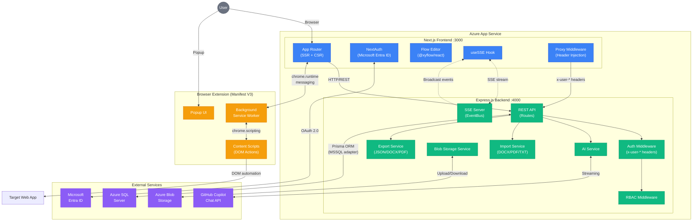
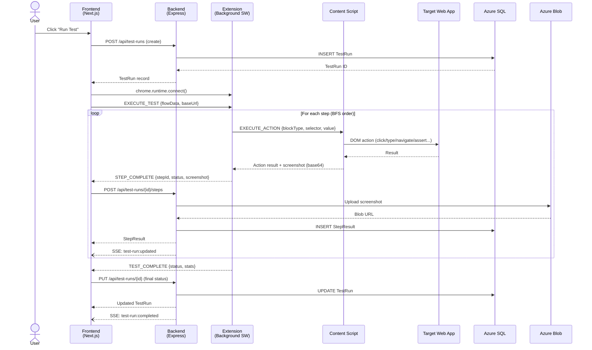
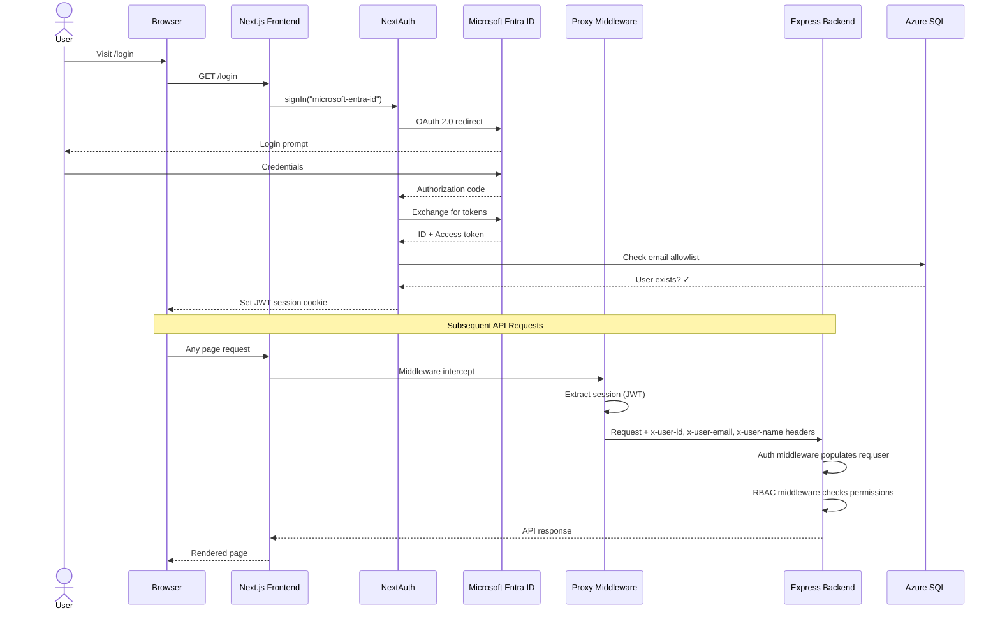
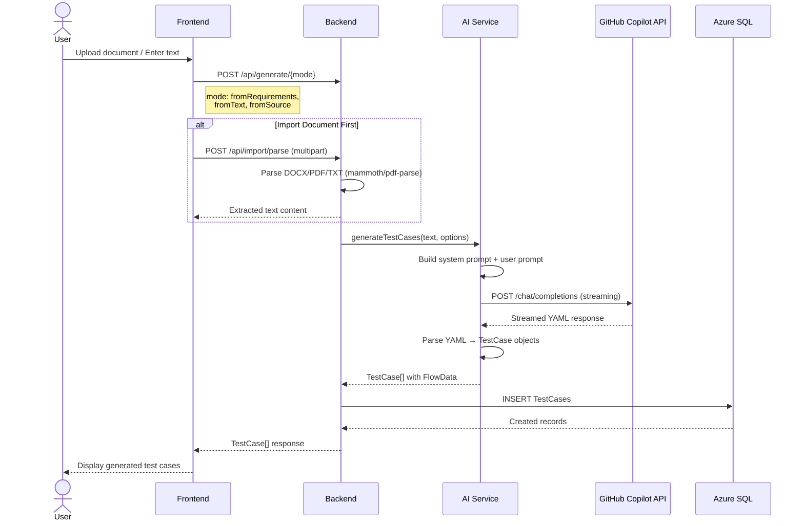
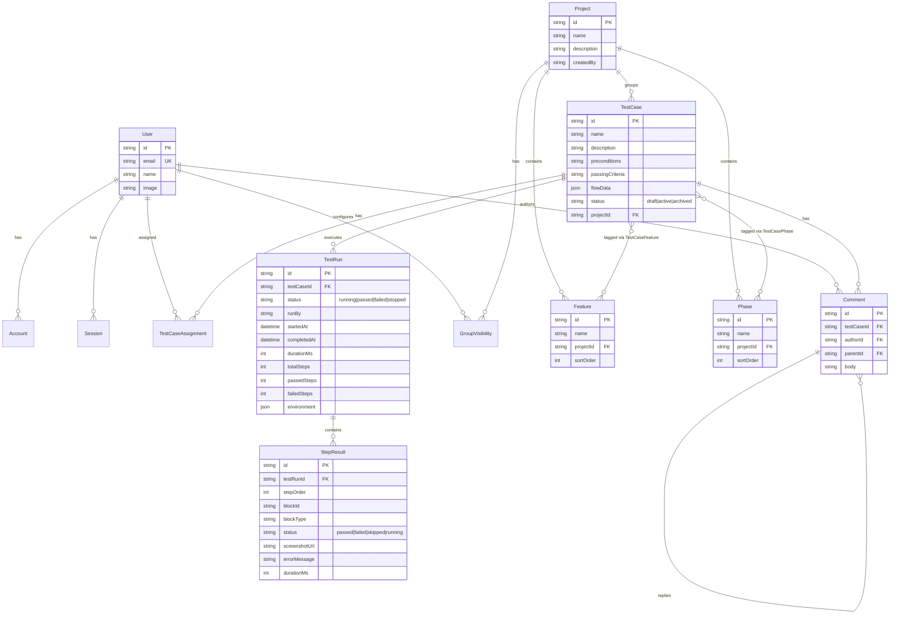
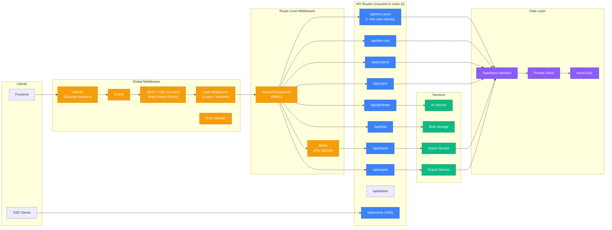
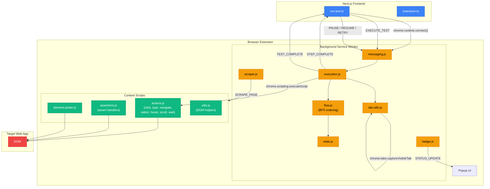
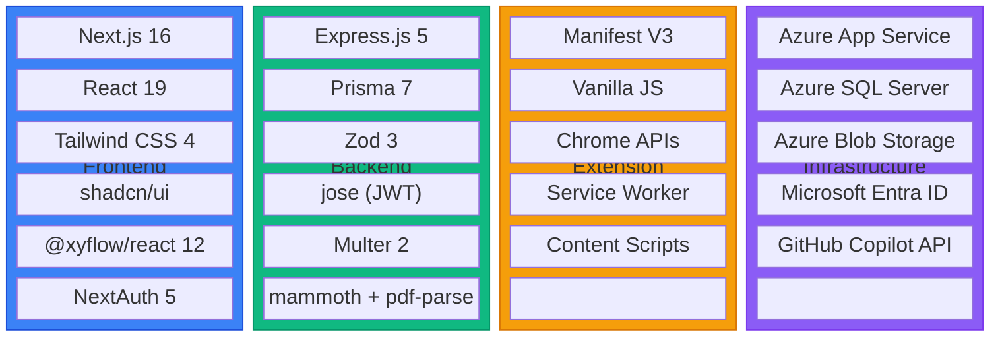

# Architecture Diagrams — QA Agent

## 1. High-Level System Architecture

## 2. Test Execution Flow

## 3. Authentication & Authorization Flow

## 4. AI Test Case Generation Flow

## 5. Data Model (Entity Relationship)

## 6. Backend Route Architecture

## 7. Extension Message Flow

## 8. Technology Stack Overview

